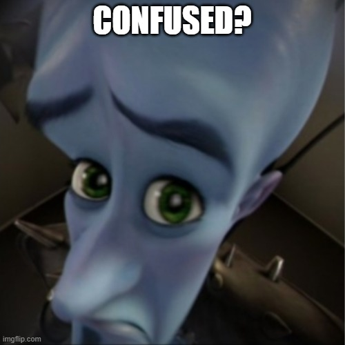

# Dart

## Ce este dart?

Dart este libajul in care noi scriem aplicatiile. E de notat ca Dart este diferit de Flutter. Dart a aparut ca limbaj inaintea lui Flutter. Putem sa ne gandim ca daca Flutter este setul de lego, dart este design-ul distinctiv al bucatilor de lego, cum ar fi diferitele conectoare de pe fiecare piesa.

Atunci flutter ce este? Un framework. Adica un set de cod predefinit (scris in dart) care simplifica dezvoltarea de aplicatii mobile/web/desktop in feluri pe care le vom explora mai in detaliu in cursurile viitoare.

Dart este un limbaj care in multe privinte este asemanator cu C++ si in multe altele este destul de diferit, însă multe concepte vor parea familiare.

Haideti sa ne uitam la cel mai simplu program in dart:

```dart
void main(){
  print('Hello World');
}

```

Observam ca la fel ca si in C++, avem o functie main. De aici se executa codul nostru in dart. Ca sa rulam nu avem nevoie sa `#include` nimic, si nici nu avem nevoie de `using namespace std;`.

Pentru a scrie ceva in consola, folosim functia print. Observam ca string-urile nu sunt delimitate cu `""` (ghilimele) ci cu `''` (apostroafe). Insa ambele delimitari se accepta. Codul de jos are acelasi efect:

```dart
void main(){
  print("Hello World");
}
```

## Variabile in Dart

Putem sa declaram o variabila in mai multe moduri:

```Dart
void main(){
  var a = 1;
  int b = 1;
}
```

Care e diferenta?

- Variabila `a` este declarata cu key-word-ul: `var`. Acest keyword iti declara o variabila fara un tip explicit (cum ar fi int sau double). Acest tip va fi inteles de catre Dart ca fiind int, pentru ca i-am atribuit 1.
- Variabila `b` este declarata exact ca in C/C++. Nimic iesit din comun.


## Tipuri de baza în Dart

### `int`

La fel ca si in C++, un intreg este reprezentat prin `int`. si declarat exact ca in c++.

```dart
void main(){
  int a, b, c = 0;
  b = 1;
  a = b + c;
}

```

Ce e important de stiut este ca intregii nu se auto-initializeaza la 0 cand sunt declarati in main. Daca de exemplu urma sa folosim a inainte sa fie atribuit, in C++ era ok si nu se supara nimeni, in dart veti fi intampinati de o eroare care spune ceva de "non nullable variable must be initialized before first use.". Fiti responsabili cu variabilele voastre!

> 💡 `int`-ul se foloseste exact ca in c++, dar daca vreti sa impartiti doua int-uri folosind operatorul `/`, rezultatul va fi mereu un `double`. Pentru împarțire cu rest, se foloseste `~/`, dar acest concept nu este foarte important.


### `float/double`

Tot ca in C++, numerele reale (cu virgula flotanta) sunt reprezentate de `float` si `double`. Cu precadere `double` este folosit mai des, dar tot ce poti face cu unul poti face si cu celalalt, dar double suporta numere mai mari.

### `bool`

Tot ca in C++. Are doua variante posibile: true sau false. Doar ca diferit de C++, `false` nu este egal cu `0`. Este incorect sa compari un numar cu un bool.

### `String`

Unul dintre cele mai importante tipuri in dart, string reprezinta un sir de caractere. Acest concept exista in C++ dar s-ar putea sa nu il cunoasteti. Ideea e ca in loc ca un sir de caractere sa fie tratat ca un sir de `char`, acesta este tratat ca o variabila de sine statatoare care poate fi atribuita, modificată, etc...

```Dart
void main() {
  String hello = "Hello World";

  hello = "goodbye";

  hello = hello + ", cruel world!";
  print(hello); //Prints: "goodbye, cruel world!"
}

```
Ce este interesant e ca in loc sa folosim functii precum strcat ca sa concatenam doua string-uri, putem doar sa folosim operatorul `+`. Cat de simplu!

Daca intamplator adaugati un punct dupa variabila string, veti fi intampinati cu o multitudine de metode pe care le puteti aplica. Cel mai simplu ar fi sa vedem cum luam lungimea unui string.

```Dart
void main() {
  String hello = "Hello World!";
  //In C: strlen(hello);
  //In C++: hello.size();
  print(hello.length); // Prints: 12
}
```

In acest caz `length` este un atribut al string-ului. 

Nu are neaparat rost sa intram in toate aceste atribute, dar puteti sa vedeti ce altceva puteti face cu un string daca va uitati la acest tutorial: [link](https://api.flutter.dev/flutter/dart-core/String-class.html).

Desigur, daca doriti sa selectati fiecare caracter dintr-un string, puteti sa folositi o sintaxa similara cu accesarea unui element dintr-un sir, dar acest lucru nu va fi atat de folosit cand vom folosi Flutter.


Un alt concept extraordinar de folositor in Dart este interpolarea de string-uri. Interpolare? Hă?

Imaginați-va ca vreti sa afisati un text de genul: "Ana are 5 mere si 8 portocale." Dar, ati vrea sa afisati acest text in functie de valoarea unor variabile din codul vostru. In C++ ati face ceva de genul asta:

```C++
int mere = 5;
int portocale = 8;
cout << "Ana are " << mere << " mere si " << portocale << " portocale.\n"
```

In dart nu avem `cout`. Dar avem functia print care ne printeaza un string si am putea sa ne folosim de ideea de concatenare a string-urilor:

```Dart
int mere = 5;
int portocale = 8;
String mesaj = "Ana are " + mere + " mere si " + portocale + " portocale.\n"; // NUUUU EROAREE
print(mesaj);
```

Acest cod va da eroare. De ce? `mere` este un `int` deci nu poate fi concatenat cu un `String`. Putem sa rezolvam aceasta problema folosind functia toString() care e apelata pe `int`-uri

```Dart
int mere = 5;
int portocale = 8;
String mesaj = "Ana are " + mere.toString() + " mere si " + portocale.toString() + " portocale\n";
print(mesaj); // Prints: Ana are 5 mere si 8 portocale.
```

Ati obosit de la atatea probleme? Eu da. Nu vreau sa fac asta de fiecare data cand vreau sa creez un string dinamic. Noroc ca dezvoltatorii Dart s-au gandit la acest aspect si au decretat: 

> "Thou shall use string interpolation!"

Interpolarea string-urilor consta in a îmbrica variabile direct in text-ul string-ului in urmatorul mod:


```Dart
int mere = 5;
int portocale = 8;
String mesaj = "Ana are ${mere} mere si ${portocale} portocale.\n";
print(mesaj); // Prints: Ana are 5 mere si 8 portocale.
```

Daca scriem `${}` in string, inauntru putem sa scriem orice variabila intre acolade. si acea variabila va fi convertita direct in string. Fara sudoare si chiar mai flexibil decat `cout` pentru ca acum putem sa folosim in continuare acel mesaj construit.

Ba chiar, inauntrul acelor acolade putem sa punem orice linie de cod care ne intoarce o valoare, deci poate cineva inspirat ar dori sa faca ceva de genul:

```Dart
int mere = 5;
int portocale = 8;
String mesaj = "Ana are ${mere} mere si ${portocale} portocale. Are in total ${mere + portocale} fructe!\n";
print(mesaj); // Prints: Ana are 5 mere si 8 portocale. Are in total 14 fructe!
```

> 💡 Observati cum la finalul fiecarui string am folosit `\n`. endl din C++ nu exista in Dart. In schimb, folosim caracterul de pagina noua `\n`. (care exista si in C/C++ 😉)

### `List`

Listele sunt echivalentul sirurilor in Dart, dar sunt unpic diferite fata de siruri. Diferentele nu sunt vizibile in mare parte pentru programatori, dar poate cei care au mai fost la olimpiada pot sa imi spuna diferenta dintre un sir si o lista inlantuita. Ideea e ca listele in dart se comporta ca si siruri, dar sunt defapt liste inlantuite. Nu conteaza asa de mult daca nu ne gandim la performanta aplicatiei noastre. Imaginati-va ca sunt siruri.

Ce este interesant aici este ca pentru a declara o lista, trebuie sa specificam si tipul de variabila care se afla in aceasta lista:

```Dart
void main() {
  List<int> numere = [0, 1, 2, 3, 4];

  print(numere[0]) //Prints: 0
  print(numere[3]) //Prints: 3
  print(numere[10]) // OOOH NOOOO!
}
```

Observam ca atunci cand vorbim de liste, de obicei elementele unei liste sunt specificate intre paranteze drepte `[]` si sunt separate prin virgula.

Ce e diferit de C++ este ca nu trebuie sa specificam o lungime maxima pentru lista, dar daca incercam sa accesam un element de la o pozitie care nu exista atunci ne va plange programul cu o eroare de indexare.

Ok, atunci cum as initializa o lista de sa zicem 100 de String-uri?? Trei metode:

```Dart
List<int> nume = [
  "Ana",
  "Marcel",
  "George",
  // ... Si tot asa pana la 100 de nume.
]
```

Sau

```Dart
List<String> nume = List.filled(100, "", growable: true);
```

Sau

```Dart
List<String> nume = []; // Empty list.

for(int i = 0; i < 100; i++){
  nume.add("");
}

```

Ok, am ajuns la partea de "si in multe altele este destul de diferit de C++".

- In prima metoda, putem sa declaram fiecare element explicit. Desi suna ca o metoda foarte proasta de a creeaa o lista de 100 de elemente (si este...) in programarea de zi cu zi in flutter, aceasta metoda de a creea o lista este cea mai des folosita. Imaginati-va un `Row()` care are ca si `children` o lista de `Widget`-uri. Nu o sa aiba 100 de copii, ci probabil cam 10 in general, in functie de cat de complicata este interfata noastra.
- In a doua metoda, putem sa folosim o functie speciala numita `List.filled()` (care se numeste constructor, dar vom vedea ce inseamna asta mai tarziu) si care ia ca parametrii lungimea listei si un element "default" cu care sa umple lista. Parametrul growable este mentionat in caz ca vrem sa mai adaugam elemente la lista sau nu mai tarziu.
- In a treia metoda, incepem de la o lista goala, declarata cu paranteze patrate: `[]` si, folosind un for foarte familiar, pur si simplu adaugam string-ul `""` la coada listei de 100 de ori.

Aici s-ar putea sa existe mai multe confuzii, dar in orice caz, aceste liste se comporta asemanator cu sirurile din C++. Hai sa incercam sa parcurgem o lista si sa afisam elementele ei:

```Dart
void main() {
  List<int> numere = [1,2,3,4,5];

  for(int i = 0; i < numere.length; i++) {
    print(numere[i]);
  }
}
```

Acest mod de parcurgere ar trebui sa va para similar. Cu toate acestea, acest mod de parcurgere are cateva dezavantaje:

- Trebuie sa folosim acel index i ca sa adresam fiecare element in parte.
- Trebuie sa apelam .length ca sa gasim lungimea listei.
- Nu e usor de urmarit / lizibil.

Desigur, daca avem nevoie de acel index, atunci este mai avantajos sa parcurgem in felul acesta. Iar daca suntem in C, nu putem sa facem ceva mai bun
> in C++ avem for(auto x:lista) dar probabil majoritatea nu stiti exact despre ce vorbesc...

In Dart putem mai bine:

```Dart
void main() {
  List<int> numere = [1,2,3,4,5];

  for(int numar in numere){
    print(numar);
  }
}
```

In modul de mai sus, putem sa parcurgem lista folosind variabila numar. Este foarte usor de citit. Codul iti spune exact ce face: "Pentru fiecare numar in numere, fa ce e aici in paranteze." Este un mod mai bun iar acest lucru se va arata mai incolo.

## Condiții și Bucle

Conditiile și buclele functioneaza exact ca in C/C++.

```Dart
void main() {
  int a = 2;
  if(a == 2){
    print('ESTE!!!');
  }
  else {
    print('NU ESTE :<');
  }
}
```

```Dart
void main(){
  while(true){
    print("computer go BRRRR!");
  }

  for(int i = 0; i < 1; i++){
    print("This loop should have been a statement. :<");
    break;
  }
}
```

> 💡 Observati ca in general cand scriu cod, pun acolada fix dupa conditie/instructiune/functie. Asta este stilul prestabilit in Dart. Poate sa fie ciudat la inceput, dar va salveaza o gramada de spatiu pe ecran.


## Funcții

Ca sa declaram si sa folosim functii in Dart, facem lucruri foarte similare cu C/C++. Pana la urma am facut asta de mai multe ori cu functia main. Hai sa ne uitam la un exemplu:

```Dart
int prim(int numar) {
  for(int d = 2; d < numar / 2; d++){
    if(numar % d == 0){
      return false;
    }
  }
  return true;
}

void main(){
  print("13 este un numar prim? ${prim(13)}"); // Prints: 13 este un numar prim? true
}
```

Cu toate acestea, exista niste mari diferente. In Dart functiile pot lua parametri dupa nume. De exemplu, o functie definita in felul acesta:

```Dart
void foo(int a, {int? b, int? c}) {
  return;
}
```

Se va apela in felul acesta:

```Dart
void main() {
  foo(1, b: 2, c: 3);
}
```


Daca inconjuram niste parametrii in acolade in header-ul functiei, acei parametrii devin optionali si trebuie numiti atunci cand trebuie pasati la apel.

Tipul unui parametru optional trebuie sa aiba ? la final, cum ar fi `int?`. Daca acel parametru nu e pasat, atunci in cadrul functiei parametrul va fi `null`. 

```Dart
void foo(int a, {int? b, int? c}) {
  print(b);
}

void main(){
  foo(1); // Prints: null.
  foo(1, b: 2) // Prints: 2.
}
```

Daca totusi vrei sa fie un parametru numit si sa nu fie optional (sau cum se refera in documentatia oficiala: `nullable`) putem sa folosim key-word-ul `required` cand declaram parametrul din functie. In felul acesta, dart ne va avertiza inainte sa rulam ca trebuie sa dam o valoare parametrilor b si c.

```Dart
void foo(int a, {required int b,required int c}) {
  print(b);
}
```

`Nullable` este un concept mai avanasat, de care nu are rost sa ne legam. Ideea e ca tu poti sa declari o variabila `nullable` si inafara header-ului unei functii, iar acea variabila ori va fi o variabila de tipul declarat, ori null. Te ajuta sa stii exact daca ai o informatie in aceea variabila sau daca nu.

```Dart
void main() {
  int? a;
  print(a); // Prints: null
  a = 2;
  print(a); // Prints: 2.
}
```

## Funcții ca variabile


Ok, let me explain:

In dart, functiile pot fi declarate in mod static dupa cum sunt declarate si in C/C++, dar pot fi declarate si dinamic. Functiile dinamice sunt declarate pe loc direct in codul nostru. Aceste functii dinamice pot fi atribuite la o variabila, iar acea variabila va avea tipul de `Function`. Aceste variabile dupa pot sa se apeleze pe sine folosind functia `.call()`.

```Dart
void main() {
  var doSomething = () {
    print('Something');
  }

  doSomething.call();
}
```

In acest exemplu, am declarat o functie dinamica si am atribuit-o variabilei doSomething. Observam ca sa creem o functie dinamica e ca si cum am scoate tipul de intoarcere si numele unei functii normale si ne raman doar parametrii sa ii definim. In cazul de sus, nu avem parametrii, dar functiile dinamice pot avea parametrii la fel ca si cele statice.

```Dart
void main() {
  var doSomething = (String something) {
    print(something);
  }

  doSomething.call("Something");
}
```

Observati cum atunci cand functia dinamica primeste parametrii, acestia apar ca si parametrii metodei `.call()`.

Acest concept este de ajutor atunci cand vrem sa specificam un anumit comportament cand un eveniment se intampla intr-o aplicatie. De exemplu o sa lucram cu butoane, am dori ca acel buton sa faca ceva atunci cand il apasam. Atunci am defini butonul in felul urmator:

```Dart
ElevatedButton(
  child: Text('Press me'),
  onPressed: () {
    print('YAHHOO!!');
  }
)
```

[dartpad](https://dartpad.dev/?id=3594da47b00c383e29b94b716ffd956e ':include :type=iframe width=100% height=800px loading="lazy"')


Puteti sa observati ca si atunci cand creati Widget-uri, felul in care se specifica atributele unui widget este similar cu felul in care se paseaza parametrii la o functie.

