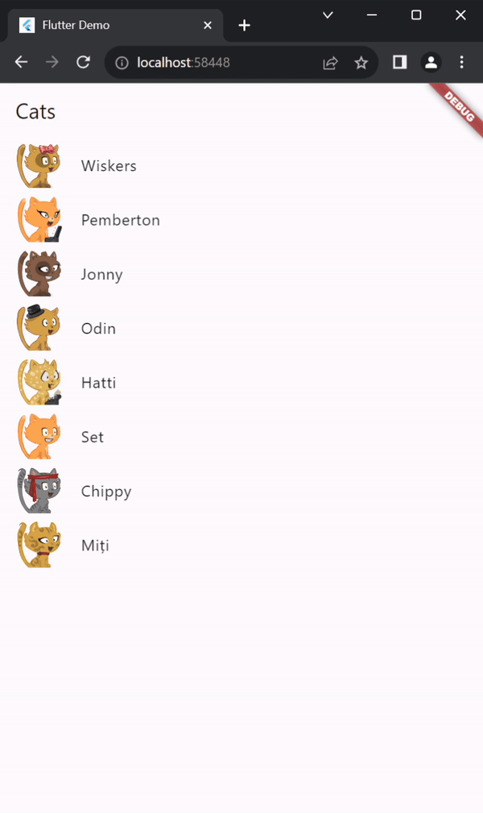

# Cat Navigator


In acest exercitiu aveti un model de aplicatie simpla, cu o lista de obiecte si atunci cand apasati pe un obiect, acesta trebuie sa va deschida o pagina noua.

Task-ul vostru este să implementati functionalitatea de navigare in aceasta aplicatie.

## Setup

Pentru a incepe, haide-ti sa ne clonam proiectul. Selectati folderul cu proiectele voastre si deschideti cmd (puteti tasta cmd in bara de sus).

Odata in cmd, copiati si paste-uiti urmatoarea comanda:

```bash
git clone https://github.com/club-flutter-blaga/cat_navigator.git
```

La finalul executiei, in folderul cu proiecte ar trebui sa aveti un folder numit cat_navigator. Deschideti acel folder in visual studio code.

?> 💡 Daca aveti erori, trebuie sa va rulati comanda `flutter pub get`, ca sa va instalati dependintele.

Odata ce aveti instalat totul, puteti sa rulati proiectul, ori din terminal cu `flutter run` ori din vs code din a patra iconiță din stanga.

## Cum ar trebui sa arate:

