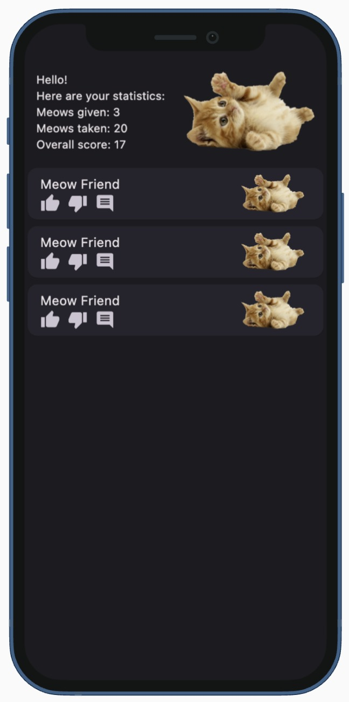

# Cat Tinder

Trebuie sa creati mai multe widget-uri si dupa sa le folositi pentru a scrie o pagina a unei aplicatii. La final, trebuie sa arate in felul urmator:



Puteti sa incepeti prin a va clona repository-ul ruland comanda asta intr-un folder la alegere:

```bash
git clone https://github.com/club-flutter-blaga/cats_tinder.git
```

Pentru a rula proiectul, va trebui sa il rulam din terminal (din motive prostești)

Odata ce ati deschis proiectul in vs code, deschide-ti terminalul integrat si rulati comanda
```bash
flutter run
```

Selectati target-ul Chrome. Pentru a face un refresh, tastati in terminal r, pentru restart tastati R.


In folderul lib, puteti sa gasisti 2 foldere si fisierul `main.dart`. Nu ne vom uita la main, ci mai degraba vom intra in widgets si vom vedea fisierul `basic_card.dart`.

## Basic Card


Acest card ia 2 parametrii: `title` si `image`.

Acest card trebuie sa aiba un titlu, si o poza cu un pisic. Pornim de la baza cu widget-ul `Card()`. Observam ca avem un titlu, si sub-titlu avem 3 iconite intr-un rand si in dreapta lor avem o imagine.

Asta ne duce cu gandul la `ListTile()` care are un titlu, un subtitlu si un trailing.

Titlul este un text, care are un string primit ca parametru (`title`)

Subtitlul e format din 3 iconite: `Icons.thumb_up`, `Icons.thumb_down`, `Icons.comment`. Aceste iconite sunt separate cu un spatiu de 10 pixeli

Trailing-ul este o imagine specificata prin parametrul `image`, folosind widget-ul `Image.network`.

## Statistics


Acest widget ia ca parametrii 3 intregi: `given`, `taken` si `score`.

Acest widget trebuie sa ne arate statisticile pisicii noastre. Observam ca e compus din doua sectiuni: partea de text si partea de imagine.

Aceste sectiuni sunt puse pe acelasi rand, dar sunt spatiate intre ele. Aici vine un `Row()` cu un mainAxisAlignment setat la `MainAxisAlignment.spaceBetween`

Sectiunea text este formata din 4 texte dispuse vertical una pe cealalta. Deci avem nevoie de un `Column()`. Aceste texte trebuie sa arate parametrii `given`, `taken` si `score`. (pentru a le afisa, putem sa folosim interpolarea de string-uri (verifica cursul despre dart)).

Trebuie sa ne aducem aminte ca comportamentul `Column()` este sa se extinda la infinit. Noi vrem ca coloana noastra sa se extinda doar cat sa intre ce e in coloana. Asa ca trebuie sa modificam parametrul `mainAxisSize` al coloanei la `MainAxisSize.min`.

La partea de imagine, vom folosi tot un `Image.network()` widget si vom pune orice url pe care vrem sa il afisam acolo. O sa observam ca totusi imaginea s-ar putea sa fie prea mare pentru ecranul nostru. Pentru a o face mai mica, putem sa adaugam la `Image.network()` parametrul `height: 100`.

Observam ca aceste elemente au o spatiere in jurul lor, deci trebuie sa inconjuram `Row()` in `Padding()` si setam parametrul `padding` la `EdgeInsets.all(15)`.

## Asamblam totul in HomePage

In acest widget, avem un `Scaffold()` inconjurat de un `SafeArea()`.

Observam ca avem widget-ul `Statistics()`, dispus pe verticala impreuna cu 3 widget-uri de tip `BasicCard()`. Aceste widget-uri sunt definite de noi, asa ca trebuie sa le importam. Daca le scriem numele ar trebui sa ne apara la sugestii. Cand selectam sugestia, se importa automat.

Statistics ia ca parametrii `given`, `taken` si `score`, deci trebuie sa ii specificam cu sintaxa de parametrii numiti.

BasicCard() ia ca parametrii `title` si `image`. Acesti parametrii sunt de tip `String` si sunt specificati cu aceasi sintaxa de parametrii numiti.

