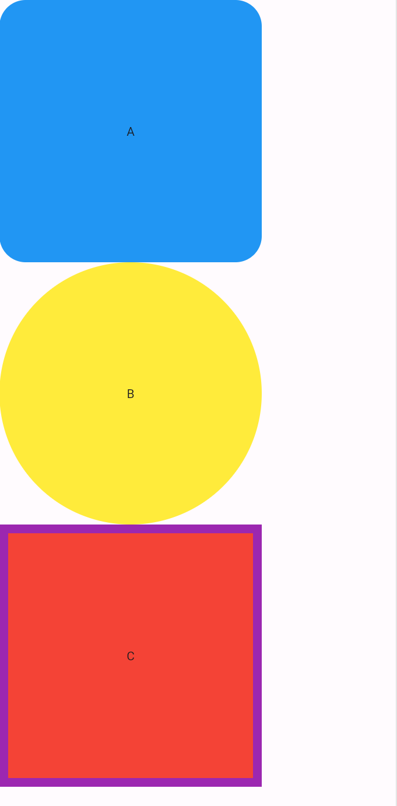

# Text Urât și Containere Urâte

Flutter e creeat in principal pentru realizarea de interfete. De aceea, multe dintre widget-urile noastre expun modalitati de a le stiliza. Astazi ne vom uita pe texte si pe containere.

Pentru a incepe, haide-ti sa ne clonam proiectul. Selectati folderul cu proiectele voastre si deschideti cmd (puteti tasta cmd in bara de sus).

Odata in cmd, copiati si paste-uiti urmatoarea comanda:

```bash
git clone https://github.com/club-flutter-blaga/ugly_text.git
```

La finalul executiei, in folderul cu proiecte ar trebui sa aveti un folder numit simple_login. Deschideti acel folder in visual studio code.

?> 💡 Daca aveti erori, trebuie sa va rulati comanda `flutter pub get`, ca sa va instalati dependintele.

Odata ce aveti instalat totul, puteti sa rulati proiectul, ori din terminal cu `flutter run` ori din vs code din a patra iconiță din stanga.

# Text

Textul se stilizeaza prin specificarea atributului `style` cu un obiect de tip `TextStyle()`. In acel obiect de text style putem sa specificam urmatoarele:

- Cat de boldat e textul cu atributul `fontWeight`
- Cat de mare e textul cu atributul `fontSize`
- Daca e scris cu italice sau nu cu atributul `fontStyle`

Pe langa TextStyle, pe widgetul `Text()` avem atributul `textAlign` care stabileste in ce directie e aliniat textul.

## Google Fonts

Google are o colectie de fonturi pe care noi le putem folosi in aplicatia noastra. Tot ce trebuie sa facem pentru a folosi acele font-uri este a atribui la atributul `style` al unui text unul dintre fonturile accesibile de pe obiectul `GoogleFonts`.

de exemplu:
```dart
Text(
  'haha',
   style: GoogleFonts.roboto,
)
```

Puteti viziona fonturile aici: [Google fonts](https://fonts.google.com/)

# Containere

Pentru a modifica stilizarea unui container, trebuie sa ii atribuim atributului `decoration` un obiect de tip `BoxDecoration`.

In acel obiect putem sa specificam urmatoarele:

- Culoarea prin atributul `color`.
- Cat de rotunde ii sunt colturile, prin atributul `borderRadius`. 
  - Valorile pot fi specificate pentru fiecare colt a containerului, sau pentru toate folosind: `BorderRadius.all(radius)` unde radius este un numar real
- Putem stiliza bordura containerului daca ii atribuim la `BoxDecoration` in atributul `border` un obiect de tip `Border.all()`.
  - In acel obiect `Border.all()` putem specifica `width`-ul bordurii, dar și culoarea prin `color`.

# Task

La final, cele doua pagini din aplicatia de pe github trebuie sa arate asa:


Primul text este mare, cu fontSize 32

Al doilea text e gri, cu un font size de 22

Al treilea text e italic

Al patrulea text este cu textAlign: TextAlign.justify

Al cincilea text foloseste fontul "Dancing Script" (puteti sa folositi ce vreti)




Primul container e albastru si are un borderRadius de BorderRadius.all(30)

Al doilea e galben si are un borderRadius de BorderRadius.all(180)

Al treilea este rosu, si are un Border.all cu width de 10 si de culoare mov.