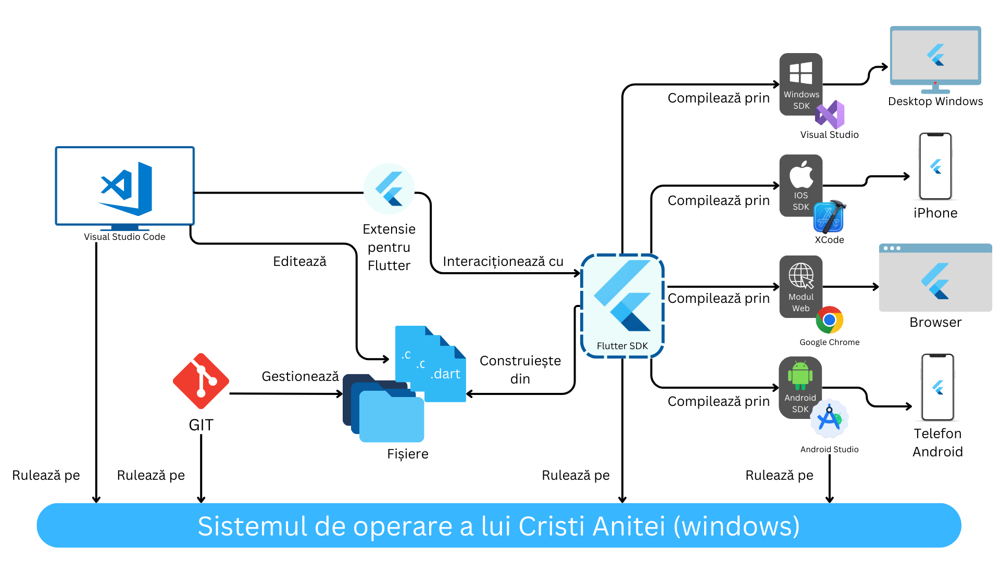

# Instalare Flutter

Pentru a folosi Flutter, avem nevoie de un anumit mediu de dezvoltare, cu un set unelte si programe  care interactioneaza impreuna pentru a construi aplicatiile mobile, web sau desktop. Aceste unelte pot fi vizualizate in diagrama de mai jos:

### 1. Git

Git este un program care gestioneaza fisierele de pe calculatorul nostru si le sincronizeaza cu un server (cum ar fi github, gitlab sau bitbucket). Nu vom intra in detalii aici, deoarece vom avea o intreaga sesiune in care exploram exact cum vom folosi git-ul.

### 2. Visual Studio Code

Ce este Visual Studio Code (VS Code)? 

In principiu, VS Code este un editor text, specializat pentru editarea de cod. Ce il face special? Faptul ca noi putem sa ii extindem functionalitatea prin extensii. Extensiile sunt niste module care ruleaza inauntrul editorului si integreaza cateva functionalitati astfel incat sa avem o experienta de dezvoltare mult mai placuta. De aceea, pe langa VS Code, vom instala si extensia Flutter pentru VS Code, ca sa putem dezvolta aplicatii flutter mult mai simplu.

### 3. Flutter SDK

SDK vine de la Software Development Kit. Daca widget-urile sunt lego-uri, SDK-ul de flutter e cutia. Flutter SDK este un program / set de librarii care ne lasa sa dezvoltam, construim, testam si asamblam aplicatiile flutter. Cand spun vreodata in curs "flutter o sa planga", la acest flutter ma refer.

### 4. Android Studio

Android studio este editorul care te lasa sa creezi aplicatii de android. Noi avem nevoie defapt doar de o componenta din android studio, deci trebuie sa il instalam si sa fie functional. Acea componenta ne permite sa dezvoltam aplicatii pentru android si sa le instalam si testam pe telefonul nostru.

### 5. Visual Studio (optional, daca vreti sa faceti aplicatii desktop)

A nu se confunda cu VS Code (desi au logo-uri similare) Visual Studio este editorul de la microsoft care iti da voie sa creezi aplicatii pentru Windows. Pentru a creea aplicatii de windows native, avem nevoie sa il instalam din acelasi motiv pentru care avem nevoie de Android Studio.

### 6. XCode (optional, doar daca aveti Mac)

XCode este Visual Studio-ul pentru dispozitivele Apple. Acest editor te lasa sa dezvolti, rulezi si testezi aplicatii pentru toate platformele apple, incluzand iPhone, Mac si iPad. Din pacate, acest editor este instalabil doar pe un mac si ai nevoie sa fie asociat cu un anumit ID valid, deci e posibil sa nu mearga printr-un VM (Virtual Machine pentru userii mai avansati).

### 7. Chrome

Avem nevoie de un browser (preferabil bazat pe chromium) pe care sa putem dezvolta aplicatii web.

## Tutorial

Cel mai simplu mod de a instala Flutter este de a urmari tutorialul de mai jos pas cu pas.

[video](https://www.youtube.com/watch?v=tun0HUHaDuE&t=830s&ab_channel=TonyDavid)

## Link-uri folositoare:

- Git: [https://git-scm.com/download/win](https://git-scm.com/download/win)
- Visual Studio Code: [https://code.visualstudio.com/](https://code.visualstudio.com/)
  - VS Code Flutter Extension [https://marketplace.visualstudio.com/items?itemName=Dart-Code.flutter](https://marketplace.visualstudio.com/items?itemName=Dart-Code.flutter)
- Android Studio: [https://developer.android.com/studio](https://developer.android.com/studio)
- Flutter SDK: [https://docs.flutter.dev/get-started/install/windows](https://docs.flutter.dev/get-started/install/windows)
