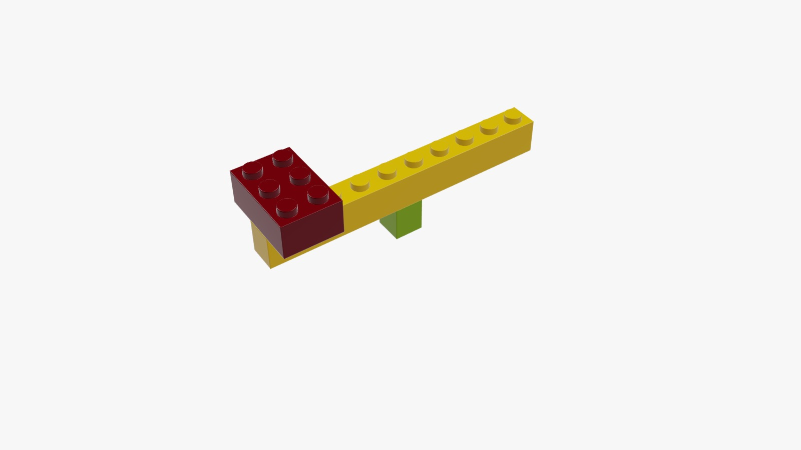
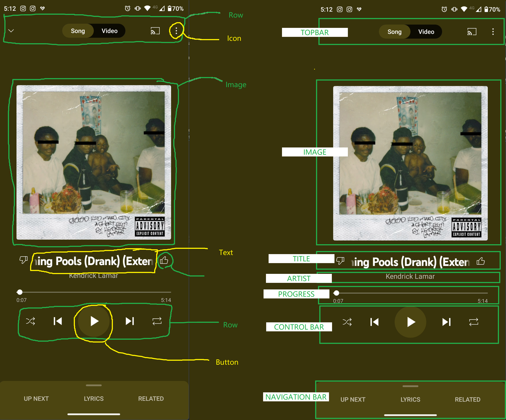

## Care este treaba cu flutter?

### Lego

Probabil ați auzit sau ați văzut în magazine acest tip de jucărie. Lego este un set de piese care vine dezasamblat iar scopul jucăriei este să-l asamblezi conform instrucțiunilor date.

Piesele în sine sunt foarte simple și neinteresante, dar dacă le combini în felul în care trebuie, poți să obții orice îți dorești, fie un dinozaur, fie o mașină etc...

Iar partea cea mai tare este că poți să nu respecți instrucțiunile. Poți să construiești ce vrei, atâta timp cât ai toate piesele potrivite.



### Filozofia Flutter

Flutter este foarte asemănător cu lego. La fel ca și piesele simple care vin într-un set de lego, flutter îți pune la dispoziție niște piese simple care se pot întrelega pentru a produce interfețe complexe și extraordinar de frumoase.

Dacă ne uităm la orice interfață de aplicație de mobil, putem să observăm că unele elemente pot fi grupate împreună, după cum vedem în exemplul de mai jos.



Putem să observăm pe acest ecran dacă ne uităm mai îndeaproape că interfața este de fapt împărțită în mici elemente care sunt aranjate împreună.

Topbar-ul este împărțit în 3 iconițe și un tab-bar care sunt aranjate într-un rând.
Titlul este format dintr-un text și 2 iconițe aranjate într-un rând.
Control bar-ul este creat dintr-un rând de butoane de diferite dimensiuni și cu diferite iconițe aranjate într-un rând.
Ideea este că putem face această împărțire la nivele diferite. Putem să împărțim pe elemente, iar împreună, aceste elemente creează o sub-grupare, cum sunt topbar-ul, titlul, control-bar-ul sau navigation bar.

Doar că, și asta este șmecheria, la rândul lor, aceste grupuri de elemente pot fi considerate și ele elemente.

Așa că putem spune că interfața noastră este formată din topbar, imagine, titlu, artist, progres, control bar și navigation bar, toate aranjate într-o coloană.

Dacă știm să compunem aceste elemente și să le aranjăm în coloane sau rânduri (sau una peste alta :wink:), putem să creăm orice interfață pe care ne-o putem imagina.

> "Ok. Ok. Dar eu nu știu să creez o imagine sau o iconiță, sau un buton. Ce fac?"

Ne întoarcem la prima analogie. Când construim cu Lego, nu începem de la zero. Nu știm să modelăm plastic încins. Dar nici nu trebuie. Toate piesele de care avem nevoie vin în pachet, standardizate și gata de construit. 😊

## Ce este un Widget?

Un widget este un element în interfață. Este un concept destul de abstract. Un widget poate să fie un buton, un text, o iconiță sau multe alte elemente care apar pe ecranul telefonului.

Doar că un widget poate să fie și un element abstract care este invizibil pe ecranul telefonului, dar care are rolul de a aranja alte widget-uri într-un anumit mod (de exemplu, rând sau coloană), sau care introduce un anumit comportament (de exemplu, SafeArea()).

Rolul nostru ca programatori este să ne folosim de aceste Widget-uri pentru a descrie interfețele pe care le dorim. Haide să despicăm exact cum arată unul dintre cele mai simple widget-uri în codul nostru:

```dart
Container(
  height: 20,
  width: 20,
  child: Text("Hello");
);

```
Observăm că un widget are un nume, urmat de două paranteze `Container()`. Înăuntrul acestor paranteze, observăm mai multe perechi de proprietăți și valori, separate de virgulă `,`.

Fiecare widget are un set de proprietăți diferit. Acestea sunt configurate prin faptul că le menționăm numele, urmat de două puncte și de valoarea acesteia. Aceste proprietăți pot să fie numere întregi `int` sau numere cu virgulă flotantă `float` sau `double`. Pot să fie chiar șiruri de caractere `String`, iar cel mai important:

**În lista de proprietăți ale unui widget există argumentul `child` sau `children` care primește un alt widget sau o listă de alte widget-uri.**

> În cazul unor widget-uri, cum ar fi `Text()`, prima proprietate nu are un nume. Acea proprietate este fără nume și este mereu pusă la începutul listei de proprietăți.

Folosind aceste proprietăți de tip `child`, noi putem să combinăm widget-uri în orice mod. Proprietățile `child` pot să primească orice widget. Ca să enumerăm câteva widget-uri avem:

- `Text()` - arată un text pe ecran.
- `Icon()` - desenează o iconiță pe ecran.
- `Container()` - creează un container cu o anumită înălțime / lățime. Containerul este invizibil dacă nu modificăm culoarea.
- `Row()` - aranjează widget-urile din lista de `children` într-un rând.
- `Column()` - aranjează widget-urile din lista de `children` într-o coloană.
- `Center()` - centrează widget-ul specificat în proprietatea `child`.
- 
## Exerciții

Unde vedeți comentarii cu todo (// TODO: ), rezolvați problemele.

> [Deschide editorul: ](https://dartpad.dev/?id=a3114e34db0ff9d74d2dffabdf723013b)