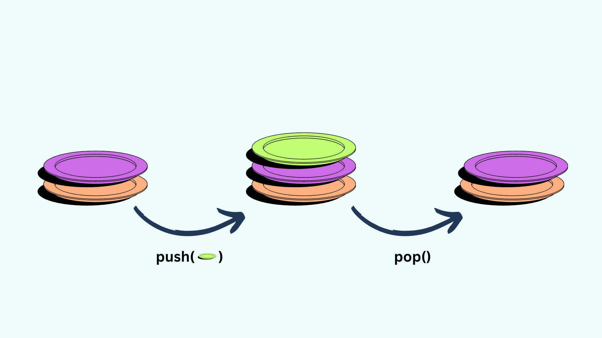

# Navigare

In nenumarate aplicatii, utilizatorii au optiunea de a naviga de la un ecran la altul. Atunci cand dai click pe un video pe youtube, ti se deschide o noua pagina unde poti sa vizionezi acel videoclip. 

Acest lucru este si mai important cand vine vorba de aplicatii mobile, deoarece in general suntem limitati grav de spatiul pe care il avem la dispozitie.

Ca solutie, flutter expune functionalitatea de navigare direct din cutia cu lego-uri. Ne vom uita exact cum sa o folosim in urmatoarele explicatii:

### Ah, o sitiva??

In aplicatii, navigarea este realizata in principal cu ajutorul unei stive. Putetsi sa va ganditi la aplicatia voastra ca un set de farfurii. Noi pana acum aveam o farfurie si o stilizam, o pictam si o expunem utilizatorului.

Dar, daca vrem sa navigam ca sa vedem alt ecran, ce se intampla cu ecranul precedent.

O stiva are doua operatii principale:

- **Adauga** la stiva un nou element in varf -> **Push**
- **Scoate** de pe stiva elementul din varf -> **Pop**

Daca dorim sa afisam o noua pagina, atunci ce vom face este sa impingem o noua pagina deasupra celei curente.



### Navigator.of(context)

Ei bine, si paginile din flutter sunt defapt doar niste farfurii intr-o stiva. Stiva noastra se numeste `Navigator` si noi putem sa il invocam in codul nostru folosind expresia:

```dart
var nav = Navigator.of(context)
```

Ce e context? Pai probabil ati vazut ca in functia build din fiecare widget, noi avem un parametru de tipul `BuildContext`. Acest parametru contine informatii importante desre arborele widget-urilor care reprezinta aplicatia noastra.

La fel cum multe lucruri in Flutter sunt defapt Widget-uri. La fel si `Navigator()` este un widget. Acesta este o componenta importanta a widget-ului `MaterialApp()` care sta la radacina tuturor aplicatiilor noastre.

Dar ce este cu chestia aia. of(context) nu stiu ce.

Ei bine, ce face acel lucru este sa mearga in sus pe widget tree si sa gaseasca navigatorul la radacina aplicatiei. In codul acela, `nav` reprezinta o referinta catre navigatorul nostru pe care o putem folosi pentru a impinge si a ne intoarce din pagini din aplicatia noastra.

Ca sa impingem o pagina noua, trebuie sa o creem. La baza fiecarei pagini exista un widget numit `MaterialPageRoute()`. Cand folosim un MaterialApp la baza aplicatiei noastre si specificam widget-ul nostru ca parametrul `home`, atunci widget-ul este inconjurat automat de catre flutter intr-un `MaterialPageRoute()`.

### Push it

Dar, casa impingem o pagina noua, trebuie sa o creem manual. Sa definim o pagina numita content. Aceasta pagina este un `StatelessWidget` intr-un fisier.


```dart
class ContentPage extends StatelessWidget {
  const ContentPage({ super.key });

  @override
  Widget build(BuildContext context) {
    return const Scaffold(
      backgroundColor: Colors.purple,
      body: Center(
        child:Text('Content'),
      ),
    );
  }
}
```

Sa spunem ca aplicatia noastra este o pagina cu un buton in mijloc. Acel buton, odata apasat, ne va trimite spre pagina de continut, folosind o functie anonima.

```dart
import 'package:flutter/material.dart';

main(){
  runApp(const MaterialApp(
    home: HomePage()
  ));
}

class HomePage extends StatelessWidget {
  const HomePage({ super.key });

  @override
  Widget build(BuildContext context) {
    return  Scaffold(
      body: Center(
        child:ElevatedButton(
          onPressed:() {
            Navigator.of(context).push(
              MaterialPageRoute(
                builder:(context) {
                  return ContentPage();
                },
              )
            );
          },
          child: const Text('TO CONTENT'),
        )
      ),
    );
  }
}
```

Ok, hai sa disecam unpic ce se intampla. Ne vom concentra pe functia `onPressed` a butonului.

```dart
Navigator.of(context).push(

  MaterialPageRoute(
    builder: (context) {
      return ContentPage();
    },
  )

);
```

Observam ca nu mai atribuim variabila `nav` ci doar apelam functia `push()` direct pe `Navigator.of(context)`.

Ca argument la functia push pasam widget-ul nostru `MaterialPageRoute()`.
Acesta are un parametru, numit `builder`. Pana acum nu am mai intalnit builderi dar schema e cam asa:

In loc sa ii dam un widget ca si parametru la MaterialPageRoute, ii vom da o functie anonima care intoarce un widget. Care e scopul aici?

Ideea e ca navigatorul nu doreste sa primeasca un widget, ci doreste sa primeasca o functie pe care el poate sa o apeleze cand vrea navigatorul sa construiasca noua pagina. In acest fel, pagina nu e construita atunci cand apesi pe buton, ci atunci cand navigatorul a incarcat noua ruta pe stiva.

### Pop it!

Acum ca suntem pe noua noastra ruta, am vrea sa ii dam utilizatorului optiunea de a se intoarce.

O sa modificam clasa noastra de content si o sa ii punem si ei un buton in mijlocul ecranului, sub content:


```dart
class ContentPage extends StatelessWidget {
  const ContentPage({ super.key });

  @override
  Widget build(BuildContext context) {
    return  Scaffold(
      backgroundColor: Colors.purple,
      body: Center(
        child: Column(
          mainAxisAlignment: MainAxisAlignment.center,
          children: [
            const Text('Content'),
            ElevatedButton(
              onPressed: () {
                Navigator.of(context).pop();
              },
              child: const Text('TO HOME'),
            ),
          ],
        ),
      ),
    );
  }
}
```
> Vezi codul [aici](https://dartpad.dev/?id=a64a344f094b8c67252d4b39e1f7ec6c).

Ca sa ne intoarcem la ruta precedenta, avem sintaxa:

```dart
Navigator.of(context).pop();
```

Practic, ca sa ne intoarcem la ruta precedenta putem pur si simplu sa apelam functia `pop()` de pe navigator.

Desigur, daca suntem pe un telefon mobil, putem sa folosim butoanele sistemului sau gesturile specifice sistemului de operare pentru a ne intoarce. Functia `pop()` se foloseste pentru a controla Navigatorul in mod programatic (adica din logica aplicatiei noastre).


> ✨ Daca widget-ul `Scaffold()` are specificata proprietatea `appBar: AppBar()`, acesta iti va construi un buton de back automat.

### Comunicare intre rute

Atunci cand impingem o noua ruta pe stiva, sau cand dam pop, putem sa pasam informatii intre acestea.

De exemplu, sa zicem ca avem o aplicatie cu o lista de obiecte. Am vrea ca atunci cand dam click pe un obiect, sa ne duca spre o pagina in care sa vizualizam mai multe date despre acel obiect.

Acest obiect este defapt informatia pe care trebuie sa o dam mai departe la ruta ca sa o afiseze.

Acesta este cel mai simplu mod de a pasa informatia. Sa zicem ca o pagina doreste un obiect de tip `Cat()` ca sa ii afiseze detaliile. 

Ei bine, pagina spre care redirectionam poate sa ia un parametru de tip cat si noi il putem oferi atunci cand apelam ruta.

```dart
class CatPage extends StatelessWidget {
  const CatPage({
    super.key,
    required this.cat,
  });

  Cat cat;

  @override
  Widget build(BuildContext context) {
    return const Scaffold(
      backgroundColor: Colors.purple,
      body: Center(
        child:Text(cat.name),
      ),
    );
  }
}
```

Atunci cand redirectionam catre pagina cat, putem sa pasam acel parametru in constructorul widget-ului `CatPage()`.

```dart

final miți = Cat(name: 'Miți');

Navigator.of(context).push(
  MaterialPageRoute(
    builder: (context) {
      return CatPage(
        cat: miți,
      );
    },
  )
);
```


Deschideti exercitiul [Cat Navigator](./exercitii/cat_navigator.md)

<!-- Navigation:
  - Understanding navigation in flutter
  - Inherited Widget
  - Basic routing examples
    - Changing pages
    - Go to the bottom
    - Showing dialogs
    - Showing bottomSheets
  - Blocking Navigation
  - Named Routes
  - Route Listeners
  - Comunicating between routes. -->