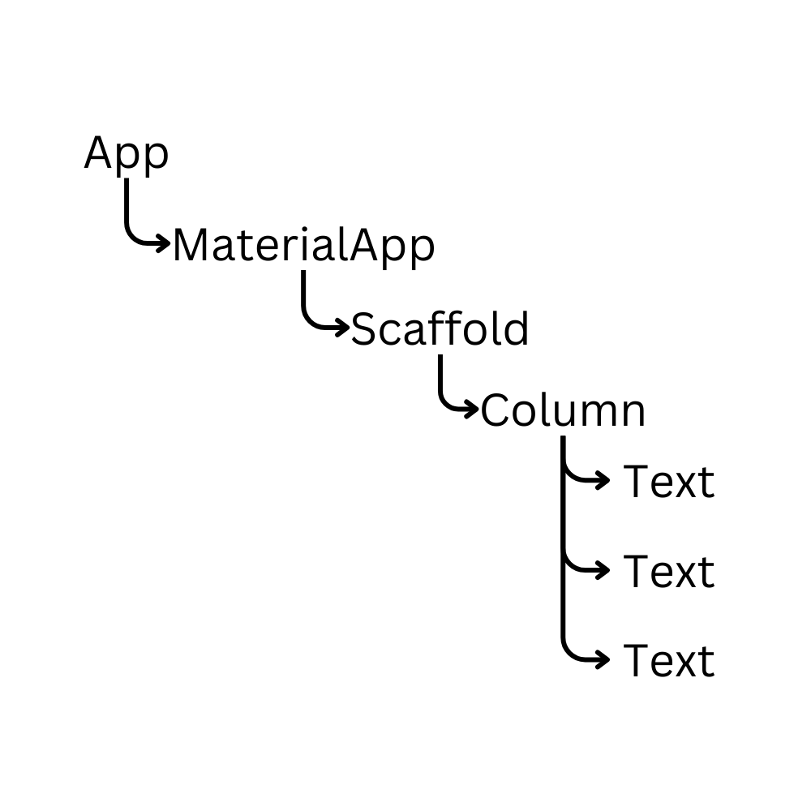

# Widget-uri cu Stare (Stateful)

Pana acum am observat ca putem sa construim interfete relativ complexe prin a folosi doar piesele de baza oferite de dart. Dar pana acum aceste interfete nu au facut multe lucruri inafara de a ne arata lucruri pe ecran. 

Cum am construit aceste interfete? Pai as vrea sa ne uitam unpic la relatia dintre widget-urile folosite de pana acum. Hai sa vedem codul urmator din lectia trecuta:

```dart
class App extends StatelessWidget {
  const App({super.key});

  @override
  Widget build(BuildContext context) {
    return const MaterialApp(
      home: Scaffold(
        body: Column(
          children: [
            Text('Title'),
            Text('Subtitle'),
            Text('Content content content content'),
          ],
        ),
      ),
    );
  }
}
```

Observam ca fiecare widget are unul sau mai multi copii, fie ca acestia sunt numiti `child` sau `body` sau `home`, exista o relatie de tata/fiu intre acestea. 

In a 11-a la liceu se invata despre arbori. Arbori sunt niste structuri de date care descriu la perfectie relatiile acestea de paternitate. Haide-ti sa ne uitam la urmatoarea ilustratie:



Ei bine, acest arbore se numeste "Widget Tree" in flutter. Acesta este structura care defapt ne descrie noua interfata aplicatiei noastre. Aceasta este structura pe care flutter stie sa o citeasca si sa o interpreteze in grafici desenate pe telefon.

Ei bine, flutter defapt face acest lucru nu doar o data, ci de 60 de ori pe secunda, unde 60 este rata de cadre a device-ului pe care il aveti. Daca aveti un telefon cu un refresh rate de 120 de hertzi, flutter va interpreta acest copac de 120 de ori pe secunda. 

Desigur, daca interfata noastra este statica, flutter nu se va obosi sa reinterpreteze widget tree-ul de 120 de ori pe secunda. Dar exista aplicatii dinamice unde elementele se schimba in timp.

Cum se descruca flutter atunci cand se schimba un element? Foarte simplu. Arunca tot arborele pe care l-a pictat la gunoi si il reinterpreteaza cu noile lui date.

Cand un widget poate sa se schimbe dinamic (adica in timpul rularii programului) noi ii zicem la acel widget `Stateful Widget`.

Un stateful widget se declara unpic mai diferit fata de cele stateless. In primul rand avem nevoie de doua clase, una care mosteneste clasa `StatefulWidget` si una care mosteneste dintr-o clasa numita `State<"numele widgetului care mosteneste">`

Haideti sa vedem pe cod:

```dart
import 'package:flutter/material.dart';

void main() {
  runApp(App());
}

class App extends StatefulWidget {
  @override
  State<App> createState() => _AppState();
}

class _AppState extends State<App> {
  final String title = 'Titlu';

  @override
  Widget build(BuildContext context) {
    return MaterialApp(
      home: Scaffold(
          body: Center(
        child: Text(title),
      )),
    );
  }
}
```

Pana acum, aceasta aplicatie e simpla. E doar un text care e centrat pe mijlocul ecranului.

Haideti sa o complicam.

In primul rand, cea mai simpla metoda de a interactiona cu o aplicatie este un buton. In flutter exista mai multe tipuri de butoane. Putem sa luam ca exemplu widget-ul `IconButton`, care are doua atribute necesare: `onPressed` care este o functie care se va executa cand apasam butonul si `icon` care este un widget reprezentand continutul butonului. Hai sa cream unul in aplicatia noastra prin a face o coloana si a pune textul si butonul in ea.

```dart

import 'package:flutter/material.dart';

void main() {
  runApp(App());
}

class App extends StatefulWidget {
  @override
  State<App> createState() => _AppState();
}

class _AppState extends State<App> {
  final String title = 'titlu';

  @override
  Widget build(BuildContext context) {
    return MaterialApp(
      home: Scaffold(
          body: Center(
        child: Column(
          mainAxisAlignment: MainAxisAlignment.center,
          children: [
            Text(title),
            IconButton(
              onPressed: (){
                title = 'titlu nou!';
              },
              icon: const Icon(Icons.thumb_up)
            )
          ]
        )
      )),
    );
  }
}

```

Observam ca onPressed primeste o functie dinamica anonima (dupa cum am discutat ca exista in dart in lectia 2.). In aceasta functie anonima vom atribui variabilei `titlu` o noua valoare (adica un string nou). Observam ca title este declarat ca un membru in clasa `_AppState`.

Apasam butonul si... nimic.

De ce?

Cum spuneam mai devreme, flutter construieste ecranul doar cand sunt schimbari de reconstruit. Dar, am schimbat variabila aceea!
Ei bine, flutter nu va reconstrui ecranul cand se schimba orice variabila. Noi trebuie sa ii specificam exact cand trebuie sa se reconstruiasca. Cum facem acel lucru?

Simplu: Folosim o functie numita `setState()` in felul urmator: 

```dart

import 'package:flutter/material.dart';

void main() {
  runApp(App());
}

class App extends StatefulWidget {
  @override
  State<App> createState() => _AppState();
}

class _AppState extends State<App> {
  final String title = 'titlu';

  @override
  Widget build(BuildContext context) {
    return MaterialApp(
      home: Scaffold(
          body: Center(
        child: Column(
          mainAxisAlignment: MainAxisAlignment.center,
          children: [
            Text(title),
            IconButton(
              onPressed: (){
                setState((){
                  title = 'titlu nou!';
                });
              },
              icon: const Icon(Icons.thumb_up)
            )
          ]
        )
      )),
    );
  }
}

```

Observam ca si functia `setState` primeste ca prim si unic argument o functie anonima dinamica. Ce se va intampla acolo? Pai, atunci cand apelam setState, flutter ne ruleaza functia pe care am dat-o ca parametru iar dupa ne reconstruieste ecranul. Asadar orice schimbari de variabile vom realiza in interiorul functiei setState, acestea se vor regasi pe ecran. Acum daca rulam codul de mai sus, ni se arata noua interfata.

Bun, dar daca de exemplu am vrea sa interactionam intr-un alt fel cu interfata. Sa zicem ca am vrea ca noi sa setam titlul, prin al modifica din aplicatie. Ce facem?

Ei bine, in general, aceste tipuri de interactiuni se realizeaza folosind widget-ul `TextField()`. Haideti sa il adaugam in coloana:

```dart

import 'package:flutter/material.dart';

void main() {
  runApp(App());
}

class App extends StatefulWidget {
  @override
  State<App> createState() => _AppState();
}

class _AppState extends State<App> {
  final String title = 'titlu';

  @override
  Widget build(BuildContext context) {
    return MaterialApp(
      home: Scaffold(
          body: Center(
        child: Column(
          mainAxisAlignment: MainAxisAlignment.center,
          children: [
            Text(title),
            TextField(),
            IconButton(
              onPressed: (){
                setState((){
                  title = 'titlu nou!';
                });
              },
              icon: const Icon(Icons.thumb_up)
            )
          ]
        )
      )),
    );
  }
}
```

Bun, dar cum extragem text-ul din TextField? Ei bine, pentru a face asta trebuie sa folosim o clasa speciala numita `TextEditingController`. Aceasta clasa nu este un widget, ci intruchipeaza defapt o valoare de text care este editabila. Acest controller putem sa il dam la textfield prin atributul `controller`, iar dupa putem sa accesam valoarea acelui textfield prin acest obiect accesand membrul sau `text`. 

Let's see the code:

```dart

import 'package:flutter/material.dart';

void main() {
  runApp(App());
}

class App extends StatefulWidget {
  @override
  State<App> createState() => _AppState();
}

class _AppState extends State<App> {
  String title = 'titlu';
  TextEditingController controller = TextEditingController();

  @override
  Widget build(BuildContext context) {
    return MaterialApp(
      home: Scaffold(
          body: Center(
        child: Column(
          mainAxisAlignment: MainAxisAlignment.center,
          children: [
            Text(title),
            TextField(
              controller: controller,
            ),
            IconButton(
              onPressed: (){
                setState((){
                  title = controller.text;
                });
              },
              icon: const Icon(Icons.thumb_up)
            )
          ]
        )
      )),
    );
  }
}
```

Sa spunem ca atunci cand apasam pe buton, am vrea ca textul sa dispara din `TextField()`. In acest caz, putem sa apelam metoda `clear` pe controller: `controller.clear()`.

```dart

import 'package:flutter/material.dart';

void main() {
  runApp(App());
}

class App extends StatefulWidget {
  @override
  State<App> createState() => _AppState();
}

class _AppState extends State<App> {
  String title = 'titlu';
  TextEditingController controller = TextEditingController();

  @override
  Widget build(BuildContext context) {
    return MaterialApp(
      home: Scaffold(
          body: Center(
        child: Column(
          mainAxisAlignment: MainAxisAlignment.center,
          children: [
            Text(title),
            TextField(
              controller: controller,
            ),
            IconButton(
              onPressed: (){
                setState((){
                  title = controller.text;
                  controller.clear();
                });
              },
              icon: const Icon(Icons.thumb_up)
            )
          ]
        )
      )),
    );
  }
}
```

